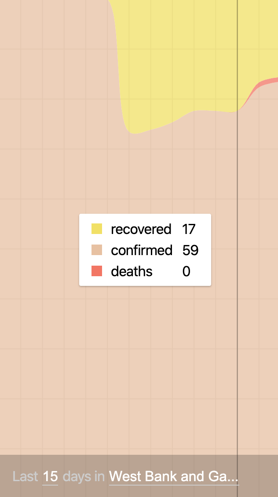

# corona stream view

Just a simple [stream view](https://corona.analogic.al) of the daily cumulative `confirmed`, `recovered` and `deaths`, for the last `15` days.

## Credits

[@pomber](https://github.com/pomber/covid19) for compiling data into a `json` format and [@rlindskog](https://github.com/rlindskog/covid19-graphql) for creating the GraphQL API.
